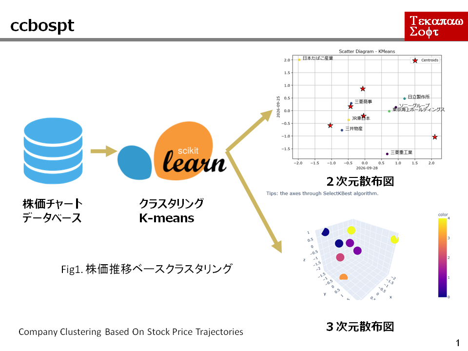

# company clustering based on stock price trajectories

# What you can do

* To learn python language and scikit-learn by using example data of stock prices.

 

 

# How to use

* Install the prerequisite python libraries

* Execute the program
  * cd ./companyClusteringBasedOnStockPriceTrajectories/src
  * python.exe app.py

 

# System
* OS: Windows 11 
* Python 3.13.14 
* Python Libraries: See the requirements.txt file

 

# Directories and Files

| Directory/File |D/F| description |
| :------------- | :-| :---------- |
| dataset | Dir | |
| dataset/data.sqlite3 | File | stock price data |
| model | Dir |  |
| model/pipe_1.8.0.pkl | File | trained model |
| output | Dir | |
| output/3DscatterDiagram.html | File | 3D scatter diagram |
| output/3DscatterDiagram.png | File | |
| output/kmeans_scatter_diagram.png | File | 2D scatter diagram |
| src/\_\_init\_\_.py | File | |
| src/app.py | File | main program |
| src/companyClustering.py | File | CCBOSPT class module |
| tests | Dir | |
| tests/\_\_init\_\_.py | File | |
| tests/test_companyClustering.py | File | CCBOSPT class test program |
| README.md | File ||
| requirements.txt | File | prerequisite libraries |

## Companies

| code | name |
| :-------- | :------|
| 2914 | 日本たばこ産 | 
| 6501 |日立製作所 |
| 6758 | ソニーグループ | 
| 7011 | 三菱重工業 | 
| 8031 | 三井物産 | 
| 8766 | 東京海上ホールディングス |
| 9020 | 東日本旅客鉄道 |
